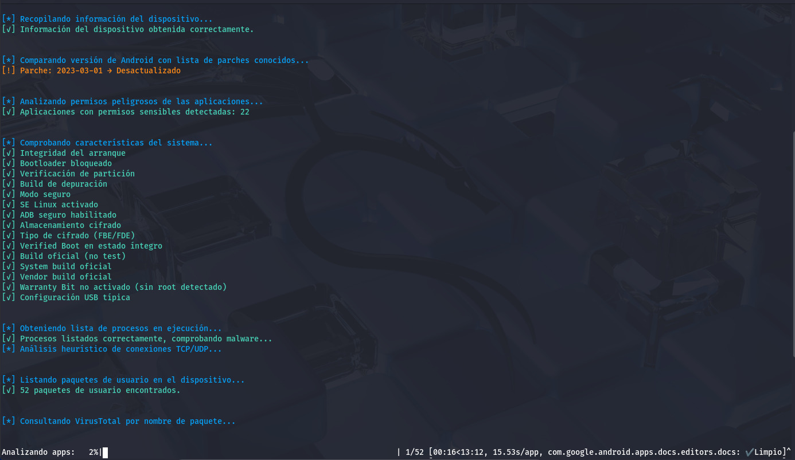

# Msecure

Msecure es una herramienta diseñada para realizar un análisis de seguridad de un smartphone Android. Tiene las siguientes características:

- Análisis de Rooteo
- Análisis de permisos
- Análisis de aplicaciones
- Análisis de versiones
- Análisis de procesos
- Generar reporte en formato JSON
- Generar reporte en formato PDF




## Instalación

1. Tener pip instalado

```jsx
pip --version
```

Instalar pip

```jsx
apt install pip
```

2. Crear un entorno virtual con python

```jsx
python3 -m venv venv
```

3. Activar el entorno (Linux)

```jsx
source venv/bin/activate
```

>[!NOTE]
>En Windows puedes activar el entorno virtual con el siguiente comando: `venv\Scripts\activate`


4. Instalar los paquetes necesarios

```jsx
pip install -r requirements.txt
```

5. Instalar ADB (Linux)

```jsx
sudo apt update
sudo apt install android-tools-adb
```

>[!NOTE]
En Windows puedes instalar ADB descargando [platform-tools](https://developer.android.com/tools/releases/platform-tools?hl=es-419).


6. Obtener API de VirusTotal para análisis de aplicaciones
7. Copiar la API en el archivo .env.template


>[!IMPORTANT]
>No olvides renombrar el archivo a `.env` después de pegar tu clave de API.


## Uso

1. Conectar Smartphone al ordenador
2. Activar la [Depuración por USB](https://developer.android.com/studio/debug/dev-options?hl=es-419)
3. Ejecutar la herramienta

```jsx
python3 msecure.py
```

>[!TIP]
>Si no se detecta el dispositivo, ejecuta adb devices y acepta la solicitud de depuración en el móvil.
